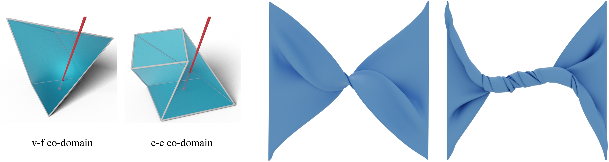

# Fast and Exact Root Parity for Continuous Collision Detection


An exact root-parity counter for continuous collision detection (CCD).


You can read more about this work in our EUROGRAPHICS 2022 paper:

["Fast and Exact Root Parity for Continuous Collision Detection"](https://todo)
```bibtex
@article{Wang:2021:Benchmark,
    title        = {Fast and Exact Root Parity for Continuous Collision Detection},
    author       = {Bolun Wang and Zachary Ferguson and Xin Jiang and Marco Attene and Daniele Panozzo and Teseo Schneider},
    year         = 2022,
    month        = april,
    journal      = {Computer Graphics Forum},
    volume       = Forthcoming,
    number       = Forthcoming,
    articleno    = Forthcoming,
    numpages     = Forthcoming
}
```
## Compiling Instruction

To compile the code, first make sure CMake and GMP are installed.

To build the library on Linux or macOS:
```sh
mkdir build
cd build
cmake ../ -DCMAKE_BUILD_TYPE=Release
make
```
Then the library `doubleccd` is built. To run an example, you can do:
```sh
cmake ../ -DCMAKE_BUILD_TYPE=Release -DCCD_BUILD_RATIONAL=ON
```
when you are compling the code, then run `build/ccd_bin` to see the results of a CCD query computed using both our algorithm (which uses double precision floating point calculation) and its pure rational version.

## The Rounding Strategy of Our Algorithm

As described in the paper, our root-parity counter is exact, only when the computation of the corners of the co-domain of the CCD function generates no rounding error. It often requires us to round the queries, sacrificing a little bit precision to return EXACT root-parity counting results. You can use `double shift_vertex_face()` or `double shift_edge_edge()` to round the query before running it, or you can set CMake option `CCD_ROUND_INPUTS` as `ON` when compling the code, then run the query, and the query will be rounded internally. The method of integrating our algorithm into simulators is introduced in the chapter "Usage" in the following context.

We also provide you an benchmark dataset [Rounded Queries](https://todo), which is generated from the [database](https://archive.nyu.edu/handle/2451/61518) provided by [Wang et al. 2020](https://github.com/Continuous-Collision-Detection) and pre-rounded. You can use the [CCD-Wrapper](https://github.com/Continuous-Collision-Detection/CCD-Wrapper), and set its CMake option `CCD_WRAPPER_WITH_FPRP=ON` to run the rounded queries.

## Usage

### To Run CCD Queries
Include the hpp file by `#include <doubleCCD/doubleccd.hpp>`

To check edge-edge ccd, use `bool doubleccd::edgeEdgeCCD()`;

To check vertex-face ccd, use `bool doubleccd::vertexFaceCCD()`;

If the root-parity is odd (one collision or three collisions in one time step), or there are infinite collisions, the ccd function will return `true`, otherwise (zero or two collisions in one time step), the ccd function will return `false`. 

### To Integrate into Simulators
It still requires to use the rounding strategy to guarantee the exactness of our algorithm when using it to detect collisions in a simulator. The basic idea is to shift the whole simulation scene to make sure there is no rounding error when calculating the corners of the CCD functions. Before you running a simulation, you should:

1. Estimate the axis-alighed bounding-box (AABB) of the whole simulation scene. It requires you to provide the two corners (x_min, y_min, z_min) and (x_max, y_max, z_max) of the AABB where the meshes would be within during the whole simulation process. It may be hard to get a very precise estimation, but a conservative AABB would be fine.

2. Re-organize the two corners of the AABB into a vector of pairs: `std::vector<std::pair<double, double>> subtractions_corners(3)={{x_min, x_max}, {y_min, y_max}, {z_min, z_max}}`.

3. Re-organize the vertices of the triangle mesh models as `std::vector<std::pair<double, double>> subtractions_meshes = {{0, x1}, {0, y1}, {0, z1}, {0, x2}, {0, y2}, {0, z2},...,{0, xn}, {0, yn}, {0,zn}}`, where `{x1, y1, z1}, ... , {xn, yn, zn}` are the n vertices of the meshes.

4. Include the file "exact_subtraction.hpp", input the two vectors into the function `static double perturbSubtractions(subtractions_meshes, subtractions_corners)`. 

5. Convert the mesh vertices back from `subtractions_meshes`, and you will get the shifted meshes.

6. Run the simulation with the shifted meshes, using our CCD algorithm.

To have a better understand, or to get more details of our Tight-Inclusion CCD algorithm, please refer to our paper.